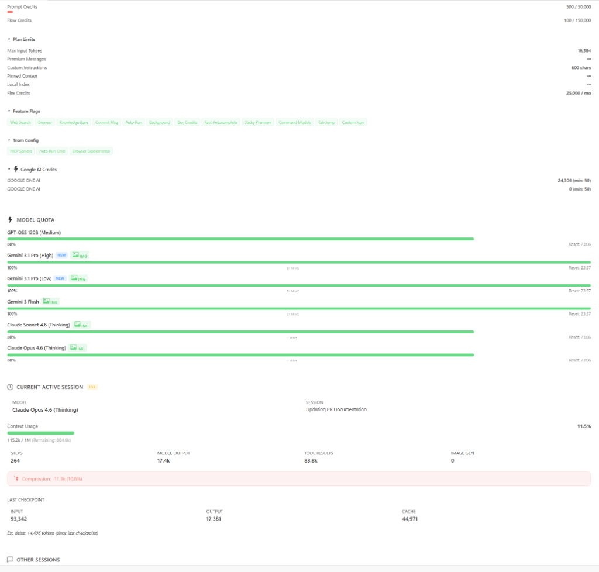

# 🌌 Antigravity Context Window Monitor

A plugin built for **Antigravity** (Google's Windsurf-based IDE) that provides real-time monitoring of context window usage across all your chat sessions.

**[🇨🇳 中文文档 / Chinese Documentation](readme_CN.md)**

---

> [!WARNING]
> **Platform Support**
>
> 🍏 **macOS**: Fully supported. Uses `ps` and `lsof` for process discovery.
>
> 🐧 **Linux**: Fully supported (v1.6.0+). Uses `ps` with `lsof`/`ss` fallback for process discovery. Tested on Ubuntu 22.04 (x64 & ARM64).
>
> 🪟 **Windows**: Fully supported (v1.8.0+). Optimized discovery with `wmic` caching and PowerShell fallbacks.

---

## 📚 Technical Details

👉 **[Read the Technical Implementation Guide](docs/technical_implementation.md)**

---

## ✨ Features

* **⚡ Real-Time Token Usage**
    Shows current token consumption in the status bar (e.g. `125k/200k, 62.5%`). Token data comes from model checkpoint values when available, with content-based character estimation between checkpoints (replaces fixed constants since v1.4.0). Fixed constants are only used as fallback when step data structure is missing.

* **🌐 Language Switching**
    Users can choose between Chinese-only, English-only, or bilingual display mode. Accessible from the details panel: click status bar → Settings → Switch Language. Preference is persisted via `globalState` across sessions.

* **🔒 Multi-Window Isolation**
    Each Antigravity window only shows conversations belonging to its workspace, filtered by workspace URI.

* **🗜️ Context Compression Detection**
    When the model auto-compresses conversation history, the plugin detects it via two-layer detection: primary layer compares consecutive checkpoint `inputTokens` (drop > 5000 tokens, immune to Undo false positives), fallback layer compares cross-poll `contextUsed` (with Undo exclusion guard). Shows `~100% 🗜` in the status bar.

* **⏪ Undo/Rewind Support**
    When you undo a conversation step, the plugin detects the `stepCount` decrease and recalculates token usage to reflect the rollback.

    | Before Undo | After Undo |
    | :---: | :---: |
    |  |  |

* **🔄 Dynamic Model Switching**
    When switching models mid-conversation, the context window limit automatically updates to match the new model. Since v1.4.0, model display names are dynamically fetched via the `GetUserStatus` API.

* **🎨 Image Generation Tracking**
    When Nano Banana Pro is invoked for image generation during Gemini Pro conversations, the associated token consumption is tracked and marked with `📷` in the tooltip. Detection is based on step type and generator model name matching.

    

* **🛌 Exponential Backoff Polling**
    When the language server is unreachable, polling interval increases as `baseInterval × 2^n` (default: 5s → 10s → 20s → 60s), resetting immediately on reconnection.

* **📊 WebView Monitor Panel** *(v1.10.1)*
    Click the status bar to open a side panel with a full-featured dashboard. Displays your account plan and tier, Prompt/Flow credit balance, per-model quota usage with color-coded progress bars, feature flags, team config (MCP Servers, Auto-Run, etc.), and Google AI credits. All data comes from the existing `GetUserStatus` API — zero additional network requests.
    * **🛡️ Privacy Mask**: A shield button in the panel header masks your name and email. The toggle state persists across panel refreshes.
    * **📂 Collapsible Sections**: Secondary info (Plan Limits, Feature Flags, Team Config, Google AI Credits) is collapsed by default. Expand/collapse state persists.

## 🤖 Supported Models

| Model | Internal ID | Context Limit |
| --- | --- | --- |
| Gemini 3.1 Pro (High) | MODEL_PLACEHOLDER_M37 | 1,000,000 |
| Gemini 3.1 Pro (Low) | MODEL_PLACEHOLDER_M36 | 1,000,000 |
| Gemini 3 Flash | MODEL_PLACEHOLDER_M47 | 1,000,000 |
| Claude Sonnet 4.6 (Thinking) | MODEL_PLACEHOLDER_M35 | 1,000,000 |
| Claude Opus 4.6 (Thinking) | MODEL_PLACEHOLDER_M26 | 1,000,000 |
| GPT-OSS 120B (Medium) | MODEL_OPENAI_GPT_OSS_120B_MEDIUM | 128,000 |

*Model IDs are fetched from the local Antigravity language server's `GetUserStatus` API. If new models are added, you can override context limits in IDE settings.*

## 🚀 Usage

1. **Install**:
   * **OpenVSX**: Install directly from [Open VSX Registry](https://open-vsx.org/extension/AGI-is-going-to-arrive/antigravity-context-monitor).
   * **Manual**: Install the `.vsix` file via Extensions → Install from VSIX.
2. **Status Bar**: The bottom-right status bar shows current context usage (displays `0k/1000k, 0.0%` for empty chats).
3. **Hover**: Hover over the status bar item for detailed info (model, input/output tokens, remaining capacity, compression status, image gen steps, per-model quota summary, etc.).

   

4. **Click — WebView Monitor Panel**: Click the status bar item to open the **WebView monitor panel** in a side panel:
   * **Account & Credits**: See your plan name, user tier, and Prompt / Flow credit balance at a glance.
   * **Model Quotas**: Each model shows a color-coded quota bar (green → yellow → red) with reset time.
   * **Current Session**: Displays the active conversation's context usage, model, step count, and compression status.
   * **Other Sessions**: Lists other recent conversations in the same workspace.
   * **Privacy Mask**: Click the 🛡️ shield button in the header to hide your name and email. The mask toggles on/off and persists across refreshes.
   * **Collapsible Details**: Click the ▶ triangles to expand Plan Limits, Feature Flags, Team Config, or Google AI Credits. These are collapsed by default to keep the panel clean.

   

## ⚠️ Known Limitations

> [!IMPORTANT]
> **Same-Workspace Multi-Window**
> If you open multiple Antigravity windows on the **same folder**, they share the same workspace URI, and session data may overlap.
>
> **Solution**: Open different folders in different windows.

> [!NOTE]
> **Compression Notification**
> The compression notification (🗜 icon) shows for ~15 seconds (3 poll cycles) before reverting to normal display.

> [!IMPORTANT]
> **Antigravity Internal Summarization**
> The Antigravity IDE has a hardcoded 7500 token "Summarization Threshold" for checkpoint summaries. This can lead to slight discrepancies in token counts for very long conversations once the threshold is crossed. For more details on this behavior, see the [Reddit reference](https://www.reddit.com/r/google_antigravity/comments/1q7zcag/heres_how_to_find_which_mcp_tools_are_leading_to/).

> [!NOTE]
> **Dynamic Sub-Agent Switching**
> When using Claude models, Antigravity may call Gemini 2.5 Flash Lite as a sub-agent for lightweight tasks. Since v1.10.0, Claude 4.6 models also have 1M context limits (GA 2026-03-13), so sub-agent switching no longer causes a visible context limit change.

## ⚙️ Settings

| Setting | Default | Description |
| --- | --- | --- |
| `pollingInterval` | 5 | Polling interval in seconds |
| `contextLimits` | (see defaults) | Override context limits per model |

## 🔤 Commands

| Command | Description |
| --- | --- |
| `Show Context Window Details` | Open a QuickPick panel listing all tracked sessions |
| `Refresh Context Window Monitor` | Re-discover the language server and restart polling |
| `Switch Display Language` | Choose between Chinese-only, English-only, or bilingual display |

## ⭐ Star History

---
**Author**: AGI-is-going-to-arrive
**Version**: 1.10.1
