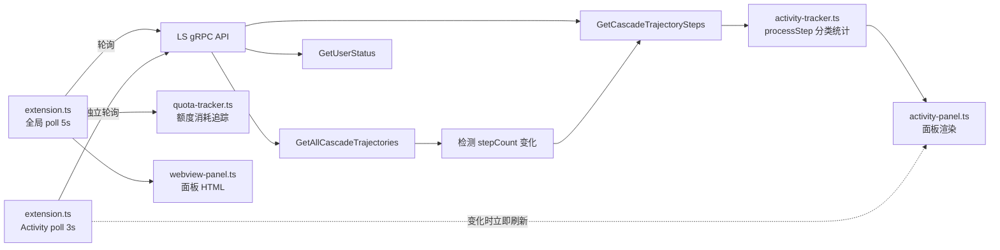

# LS Monitor 技术实现文档

> **v1.12.3** — 2026-03-22

> [!NOTE]
> 本文档所描述的监控数据**完全依赖 LS（Language Server）的 gRPC-over-HTTP API** 返回的数据进行统计和展示。受限于 API 的约 5MB 响应大小限制（约 500 步），超出此窗口的步骤只能通过 `stepCount` 差值进行推算（标注为 📊 推算步数），无法获取精确分类。如有估算偏差或数据不完整，敬请谅解。

## 概述

通过轮询 LS 的 gRPC-over-HTTP API，精确追踪每次 AI 推理调用、工具使用、耗时和 token 消耗。核心逻辑已完全集成到 VS Code 扩展模块中（早期独立脚本 `ls-monitor.ts` 已移除）。

## 架构



## 核心 API

### LS 发现

| 方法 | 说明 |
|---|---|
| `wmic` + `netstat` | 查找 `language_server_windows` 进程，提取 PID、CSRF token、端口 |
| TLS `https://127.0.0.1:{port}` | 连接 LS 的 gRPC-over-HTTP 端点 |

### RPC 端点

| 端点 | 用途 |
|---|---|
| `GetUserStatus` | 获取可用模型列表 (`clientModelConfigs`) |
| `GetAllCascadeTrajectories` | 获取所有对话的 `stepCount` 和状态 |
| `GetCascadeTrajectorySteps` | 获取某对话的全部步骤详情 |
| `GetCascadeTrajectoryGeneratorMetadata` | 获取某对话的 `generatorMetadata[]`（轻量，不含完整 trajectory） |

## 步骤类型分类

### 已识别的步骤类型

| CORTEX_STEP_TYPE | 图标 | 分类 | 说明 |
|---|---|---|---|
| `PLANNER_RESPONSE` | 🧠 | reasoning | AI 推理/回复 |
| `VIEW_FILE` | 📄 | tool | 查看文件 |
| `CODE_ACTION` | ✏️ | tool | 编辑代码 |
| `RUN_COMMAND` | ⚡ | tool | 执行命令 |
| `COMMAND_STATUS` | 📟 | tool | 命令状态 |
| `LIST_DIRECTORY` | 📂 | tool | 列出目录 |
| `FIND` | 🔍 | tool | 搜索 |
| `GREP_SEARCH` | 🔎 | tool | Grep 搜索 |
| `CODEBASE_SEARCH` | 🗂️ | tool | 代码库搜索 |
| `MCP_TOOL` | 🔌 | tool | MCP 工具调用 |
| `SEARCH_WEB` | 🌐 | tool | 网页搜索 |
| `READ_URL_CONTENT` | 🌐 | tool | 读取 URL |
| `BROWSER_SUBAGENT` | 🤖 | tool | 浏览器子代理 |
| `ERROR_MESSAGE` | ❌ | system | 错误 |
| `USER_INPUT` | 💬 | user | 用户输入 |
| `CHECKPOINT` | 💾 | system | Checkpoint |
| `CONVERSATION_HISTORY` | 📜 | system | 历史上下文 |
| `KNOWLEDGE_ARTIFACTS` | 📚 | system | 知识库 |
| `EPHEMERAL_MESSAGE` | 💨 | system | 临时消息 |
| `TASK_BOUNDARY` | 📋 | system | 任务边界（Agentic 模式） |
| `NOTIFY_USER` | 📢 | system | 通知用户（Agentic 模式） |

### 浏览器子代理内部步骤

| 内部类型 | 标签 | 说明 |
|---|---|---|
| `BROWSER_PRESS_KEY` | 按键 | 模拟键盘输入 |
| `CLICK_BROWSER_PIXEL` | 点击 | 点击像素坐标 |
| `BROWSER_MOUSE_WHEEL` | 滚动 | 鼠标滚轮 |
| `BROWSER_GET_DOM` | DOM | 获取 DOM |
| `OPEN_BROWSER_URL` | 打开URL | 导航到 URL |
| `WAIT` | 等待 | 延迟等待 |

## 关键数据字段

### 步骤元数据 (step.metadata)

```
metadata: {
  generatorModel:       "MODEL_PLACEHOLDER_M26"     // → 模型 ID
  createdAt:            "2026-...Z"                  // 步骤创建时间 (UTC)
  finishedGeneratingAt: "2026-...Z"                  // 模型输出完成时间 ✅ 实时可用
  viewableAt:           "2026-...Z"                  // 可见时间
  completedAt:          "2026-...Z" | undefined      // 完成时间 ⚠️ 实时获取时推理步骤可能为 undefined
  toolCallOutputTokens: "145"                        // 工具返回内容的 token 数 ✅ 精确
  toolCall: {
    name:           "view_file"                      // 工具名
    argumentsJson:  "{...}"                          // 工具参数 JSON
  }
  modelUsage: { model: "...", ... }                  // checkpoint 里的模型配额使用情况
}
```

### BROWSER_SUBAGENT 结构

```
step: {
  type: "CORTEX_STEP_TYPE_BROWSER_SUBAGENT"
  browserSubagent: {
    task:          "Navigate to ..."                  // 完整任务描述
    taskName:      "Publish Message"                  // 任务标题
    taskSummary:   "..."                             // 任务摘要
    result:        "我已经..."                        // 执行结果文本
    recordingPath: "file:///...webp"                  // 录屏文件路径
  }
  subtrajectory: {
    trajectoryType: "CORTEX_TRAJECTORY_TYPE_BROWSER"
    steps: [ ... ]                                    // 完整子步骤数组 (可达100+步)
  }
}
```

## 踩坑记录

### 1. completedAt 实时不可用

**现象**：推理步骤在实时轮询时 `completedAt = undefined`
**原因**：LS 在步骤完成后并不立即写入 `completedAt`，只在对话结束/checkpoint 后回填
**修复**：推理耗时用 `finishedGeneratingAt`（实时可用），工具耗时用 `completedAt`

### 2. stepCount 波动

**现象**：`stepCount` 从 16→15→16 波动，导致增量检测失败
**原因**：LS 在 RUNNING 状态下 `stepCount` 可能短暂下降
**修复**：当 `curr < prev` 时重置基线为 `currSteps`

### 3. toolCallOutputTokens 含义

- **不是**模型的输入/输出 token
- **是**工具返回给模型的输出内容的 token 数
- 精确度：✅ LS 内部追踪，用于配额计费
- 仅在工具步骤出现，推理步骤为 `undefined`

### 4. 模型名称映射

- LS 内部用 `MODEL_PLACEHOLDER_M26` 等占位符
- 通过 `GetUserStatus` → `clientModelConfigs` 获取 `{ model → label }` 映射
- 例：`MODEL_PLACEHOLDER_M26` → `Gemini 3.1 Pro (High)`

### 5. API 响应 ~5MB 大小限制（startIndex 在当前 LS 版本无效）

- `GetCascadeTrajectorySteps` 每次返回 **≈5.2MB** 数据（约 400-500 步）
- 这是 **5MB 响应大小限制**（经第三方开发者确认），不是步骤数量限制
- 在当前 LS 版本中，`startIndex/endIndex` 参数不生效 — 无论传什么值，始终返回相同的首批步骤
- 所有步骤类型中，**AI 生成的步骤**（PLANNER_RESPONSE、tool 类）都有 `metadata.generatorModel` 字段
- **系统/用户步骤**（EPHEMERAL_MESSAGE、USER_INPUT、CHECKPOINT）没有模型名

**诊断数据（diag-steps.ts）：**

```
RUNNING 对话 (1217 steps):
  [0-50]    → 506 步, 5219KB  (请求 50 步，返回 506)
  [50-100]  → 506 步, 5219KB  (完全相同)
  [1167-1217] → 506 步, 5219KB  (完全相同)

IDLE 对话 (2443 steps):
  7 种 startIndex/endIndex 组合 → 全部返回 419 步, 5293KB
  camelCase/snake_case 字段名 → 无差异
```

**解决方案：Per-Trajectory dominantModel 归属**

```typescript
// 1. 初次处理 API 返回的 ~500 步时，检测该对话的主模型
entry.dominantModel = _detectDominantModel(steps);

// 2. 后续 stepCount 增长（delta > 0）时，直接归属到该模型的 estSteps
if (delta > 0 && entry.dominantModel) {
    const s = _getOrCreateStats(entry.dominantModel);
    s.estSteps += delta;   // 独立计数，不混入 reasoning/toolCalls
    s.totalSteps += delta;
}
```

> ⚠️ 推算步数（📊 标注）仅记录总增量，无法区分 reasoning / toolCalls / errors。
> `dominantModel` 和 `estSteps` 均通过 `globalState` 持久化，跨重启保留。

## 运行方式

活动追踪已完全集成到 VS Code 扩展中，随扩展自动激活。无需手动运行脚本。

```
扩展激活
  ├─ extension.ts 全局轮询 (5s) → 上下文/额度/用户状态
  └─ extension.ts Activity 独立轮询 (3s) → activity-tracker.ts 分类统计 → activity-panel.ts 渲染
```

## PLANNER_RESPONSE 完整结构

```
plannerResponse: {
  thinking:           "思考过程..."          // AI 思维链（可选）
  thinkingSignature:  "base64..."           // 思考签名（可选）
  thinkingDuration:   "2.780691100s"        // ✅ 精确思考耗时
  response:           "以下是..."            // ✅ 最终回复文本
  modifiedResponse:   "以下是..."            // 修改后版本
  messageId:          "bot-uuid..."         // 消息 ID
  toolCalls:          { 0: {...}, ... }     // 工具调用（可选）
  stopReason:         "STOP_REASON_STOP_PATTERN"
}
```

> ⚠️ `plannerResponse.text` 不存在！正确路径是 `.response` 或 `.modifiedResponse`

## CHECKPOINT.modelUsage — 精确 Token 数据

```
metadata.modelUsage: {
  model:                "MODEL_GOOGLE_GEMINI_2_5_FLASH_LITE"
  inputTokens:          "2544"              // ✅ 精确输入 token
  outputTokens:         "46"                // ✅ 精确输出 token
  responseOutputTokens: "46"
  apiProvider:          "API_PROVIDER_GOOGLE_GEMINI"
  responseId:           "..."
  responseHeader:       { sessionID: "..." }
}
```

> Token 数据**仅**在 CHECKPOINT 步骤中出现，PLANNER_RESPONSE 的 metadata 里没有 token 字段

## USER_INPUT 结构

```
step.userInput: {
  items:          [{ text: "用户消息" }]    // ✅ 用户文本在这里
  userResponse:   { 0:"查", 1:"询", ... }  // 逐字流式输入
  activeUserState: { ... }
  clientType:     "CHAT_CLIENT_REQUEST_STREAM_CLIENT_TYPE_IDE"
  userConfig:     { ... }
}
```

> ⚠️ `userInput.text` 不存在！正确路径是 `userInput.items[0].text`

## 踩坑记录补充

### 6. userInput.text 不存在

**现象**：`step.userInput.text` 返回 `undefined`
**正确路径**：`step.userInput.items[0].text`
**说明**：`items` 是数组，通常只有一个元素

### 7. plannerResponse.text 不存在

**现象**：`step.plannerResponse.text` 返回 `undefined`
**正确路径**：`.response` 或 `.modifiedResponse`
**说明**：AI 仅发工具调用时 `response` 为空字符串或不存在

### 8. thinkingDuration 是字符串

**格式**：`"2.780691100s"` — 纳秒级精度
**解析**：`parseFloat(str.replace('s',''))` → 秒数

### 9. stopReason 实时不可靠

**现象**：流式输出中 `plannerResponse.stopReason` 为 `undefined`
**原因**：LS 在模型输出完成前不设置 `stopReason`
**修复**：不用 `stopReason` 判断是否有回复，直接读取 `modifiedResponse || response` 内容
**补充**：AI 回复现在仅捕捉 80 字符短预览，不再需要精确完整回复

### 10. warm-up 必须处理所有对话

**现象**：长时间对话（500+ 步骤）只更新了步骤数但模型统计全 0
**原因**：IDLE 对话在 warm-up 时被设为 `processedIndex = stepCount`（跳过所有步骤）
**修复**：warm-up 对所有对话（含 IDLE）都拉取并处理步骤

### 11. toggle 事件绑定错误

**现象**：点击切换开关无反应
**原因**：`change` 事件绑在 `<label>` 上，但 `change` 只在 `<input>` 上触发
**修复**：通过 `querySelector('input[type="checkbox"]')` 找到内部 checkbox 绑定

## Activity Tracker 架构

### 模块分工

| 文件 | 职责 |
|---|---|
| [activity-tracker.ts](../src/activity-tracker.ts) | 数据处理：步骤分类、统计、时间线、序列化/反序列化 |
| [activity-panel.ts](../src/activity-panel.ts) | UI 渲染：概览卡片、模型卡片、时间线 HTML + CSS |
| [extension.ts](../src/extension.ts) | 粘合层：poll → processTrajectories → 面板刷新 |

### warm-up 与增量策略（v1.11.2 更新）

```
首次 poll → warmedUp = false
  ├─ 所有对话（含 IDLE）→ 拉取全部步骤 → processStep 逐步统计
  └─ warmedUp = true
后续 poll → warmedUp = true（独立 3s 轮询）
  ├─ 新对话 stepCount=0 → 不创建 entry，等待有步骤后首次拉取
  ├─ 新对话 stepCount>0 → 创建 entry → 拉取全部步骤（emitEvent=true）
  ├─ RUNNING 对话 → 重新拉取步骤，处理新增部分
  └─ IDLE 且已处理过 → 跳过（不会再有新步骤）
```

> v1.11.2 变更：Activity 追踪从全局 poll 分离为独立 3 秒轮询循环。
> 仅对 RUNNING 对话发起步骤拉取，IDLE 对话在首次处理后跳过。
> recheck 机制已移除（AI 回复仅捕捉 80 字符短预览，不需要回退重查）。

### 数据范围

- `GetAllCascadeTrajectories` 返回 LS 实例的**所有**对话（跨工作区/跨窗口）
- warm-up 统计全部对话 → 反映完整额度周期使用量
- 额度重置时 `archiveAndReset()` 归档快照并清零统计

### 额度重置自动归档（v1.11.2 新增，v1.11.6 重构）

```
processUpdate() 遍历所有模型
  ├─ 检测到 fraction 跳回 ≥ 1.0 → resetModels.push(modelId)
  └─ 循环结束后，若 resetModels.length > 0
     └─ 一次性触发 onQuotaReset(resetModels: string[])
        └─ activity-tracker.archiveAndReset(modelIds)
            ├─ 检查 totalReasoning > 0 || totalToolCalls > 0（跳过空归档）
            ├─ 防抖：最近归档 < 5min → 合并到最近归档（triggeredBy 去重合并）
            ├─ 否则：新建归档 → _archives.unshift({ summary, triggeredBy: modelIds })
            ├─ 清零所有统计（modelStats/counters/recentSteps）
            ├─ 保留 _trajectories 基线（避免 warm-up 重新统计历史）
            └─ 保留 _warmedUp = true（增量跟踪继续）
```

> 关键设计：同池多模型（如 Pro High/Low）只触发 1 次回调 + 1 条归档。不同池间隔 < 5min 重置时防抖合并为 1 条。

## 额度数据来源

### API 路径

```
GetUserStatus → clientModelConfigs[]
  └─ quotaInfo: {
       remainingFraction: 0.85,   // 0.0~1.0，剩余额度比例
       resetTimestamp: "2026-...Z" // 下次重置时间
     }
```

### 重置信号检测（quota-tracker.ts 第 152 行）

```
tracking 状态 + fraction ≥ 1.0 = 额度已重置
  ├─ 当前 quota session 归档
  ├─ 状态 → idle
  └─ ★ 可以在此触发 activity 归档
```

### 额度周期类型

| 类型 | 重置周期 | 对应模型 |
|---|---|---|
| Premium 额度 | ~5 小时 | Gemini 3.1 Pro (High) 等 |
| 会员额度 | ~7 天？ | 待确认 |

> 注：不同模型可能有独立额度周期，通过 `resetTimestamp` 可判断

## 诊断脚本

> 注：早期诊断脚本（`diag-verify.ts`、`diag-monitor.ts`、`diag-quota.ts`、`diag-reset.ts`）已在 v1.11.3 中删除。功能已完全集成到扩展模块中。LS 数据探索结果已记录在下方 Bug 记录中。

---

## 文件位置

- 插件源码：`src/`
- 单元测试：`src/*.test.ts`
- 技术文档：本文件

> 注：独立终端脚本 `ls-monitor.ts` 已删除（v1.11.2），功能完全集成到扩展模块中。

## 踩坑记录补充（二）

### 12. 增量步骤捕获 bug（已修复）

**现象**：增量更新时新步骤显示为 `+N steps (estimated)` 而非逐步精确捕获
**原因**：`processTrajectories` 增量路径在 `processedIndex > 0` 时直接使用 `stepCount` delta 估算，不重新拉取步骤
**修复**：增量路径重新调用 `GetCascadeTrajectorySteps` 拉取步骤，仅对超出 API 窗口的步骤使用 delta 估算

### 13. 新对话首消息延迟（已修复）

**现象**：新对话的第一条消息不出现在 timeline，要到第二条消息才刷新
**原因**：新对话首次出现时 `stepCount=0`（LS 还在初始化），代码创建了 `processedIndex=0` 的空 entry；下次 poll 时 `0 <= 0` → skip
**修复**：`currSteps === 0` 的新对话不创建 entry，等到有步骤时才创建并拉取

### 14. 思考时间在轮询模式下不准确

**现象**：3 秒轮询捕获到正在进行中的 PLANNER_RESPONSE 时，`thinkingDuration` 为部分值
**决策**：Timeline 行级推理事件不显示 `durationMs`（设为 0），模型卡片中的聚合 `thinkingTimeMs` 保留（累积后偏差会平衡）

### 15. StreamCascadePanelReactiveUpdates（未采用）

**发现**：LS 内部有 `StreamCascadePanelReactiveUpdates` 双向 gRPC 流，可实时推送 Cascade 状态变化
**限制**：需要 protobuf 二进制解码 + HTTP/2 持久连接 + 逆向 proto 定义；当前 Connect-RPC (HTTP/JSON) 无法使用
**现状**：保持 3 秒 HTTP 轮询方案，对 95% 的对话（< 500 步）已足够精确

### 16. LS 进程有 3 个端口（实测 v1.11.3）

**发现**：LS 进程绑定了 3 个 `127.0.0.1` 端口（如 3618、13856、13857）
**RPC 端口**：仅其中一个是 Connect-RPC（HTTPS）端口，其余为 extension server 或其他内部用途
**影响**：端口探测必须遍历所有 LISTENING 端口 + HTTP/HTTPS 双重尝试，取第一个可达的

### 17. API 窗口边界实测数据（v1.11.3）

**实测结果**（2026-03-20）：

| 对话 | stepCount | API 返回 | 不可见 | 响应大小 |
|---|---|---|---|---|
| 505 步（RUNNING） | 505 | 426 | 79 | — |
| 2443 步（历史） | 2443 | 419 | 2024 | 5084 KB |

**结论**：
- 窗口大小由 **响应体积（~5MB）** 决定，不是固定步数
- 不同对话返回的步数略有差异（419 vs 426），取决于每步的数据量
- `startIndex/endIndex` 参数持续无效（v1.11.3 验证）
- 超出窗口的步骤用 📊 图标 + `stepIndex` 标记起始位置，保持排版一致

### 18. Warm-up 吞噬首消息（v1.11.3 修复）

**现象**：扩展加载/重载后，当前对话的第一条用户消息从不出现在"最近操作"时间线中
**根因**：Warm-up 阶段用 `emitEvent=false` 处理所有已有步骤（含 USER_INPUT），设置 `processedIndex` 后，增量模式不再触碰这些步骤
**修复**：Warm-up 完成后，对 RUNNING 对话的最近 30 步调用 `_injectTimelineEvent()`——仅创建 `StepEvent`，不重复统计。使用 LS 的 `metadata.createdAt` 作为历史时间戳

### 19. 切换/回退对话：status 时序与 stepCount 回退（v1.11.3 修复）

**现象**：切换到已有对话发消息，或回退/重发消息时，新步骤无法录入时间线
**诊断**（实时脚本 2 秒轮询 `GetAllCascadeTrajectories`）：

```
21:05:15 [CHANGE] b365cb34 | status: IDLE → RUNNING | steps: 31 → 33 (+2)
         ↳ API returned 33 steps, including USER_INPUT at [31]
21:05:29 [CHANGE] b365cb34 | steps: 33 → 35 (+2)
21:05:43 [CHANGE] b365cb34 | status: RUNNING → IDLE
```

**LS 行为确认**：切换对话时 LS 正常更新 status（IDLE→RUNNING）和 stepCount，API 完整返回含 USER_INPUT 的步骤

**Bug 1 — statusChanged 被早期跳过拦截**：

```typescript
// BUG: 这行在 statusChanged 检测之前，直接跳过了
if (currSteps <= entry.processedIndex) { continue; }
// statusChanged 永远执行不到
```

**Bug 2 — stepCount 回退未被处理**：
回退/重发时 LS 可能删除旧步骤后生成新步骤，导致 stepCount 暂时减少。
旧 `processedIndex` 仍指向已不存在的位置，增量比较失效。

**修复**：
1. `statusChanged` 检测移到**所有跳过逻辑之前**
2. 检测 stepCount 减少 → 重置 `processedIndex = Math.min(processedIndex, currSteps)`
3. 所有跳过条件加 `&& !statusChanged` 保护
4. 当 statusChanged 但 processedIndex 不变时，注入最近 20 步 timeline 事件

### 20. 推理步骤 response 字段可为空

**现象**：部分 `PLANNER_RESPONSE` 步骤的 `modifiedResponse` 和 `response` 均为空字符串，导致时间线行只有模型名，没有内容预览
**原因**：LS 在推理中途被轮询捕获时，response 尚未填充；或纯思考步骤没有文本输出
**策略**：当 response 为空且 `thinkingDuration` 存在时，显示"正在思考"作为回退文本（不显示具体秒数，因 3 秒轮询中断导致时间不准确）

### 21. remainingFraction 耗尽时字段消失 + 100% 动态检测（v1.11.3 修复）

**现象 1**：模型额度耗尽时，`quotaInfo.remainingFraction` 字段**从 API 响应中消失**（不是返回 `0`）
**影响**：`quota-tracker.ts` 中 `fraction` 为 `undefined`，JS 比较 `undefined >= 1.0` / `undefined <= 0` 均为 `false`，状态机卡死
**修复**：`fraction = config.quotaInfo.remainingFraction ?? 0`（与 `tracker.ts:570` 的兜底对齐）

**现象 2**：模型额度为 100% 时，无法区分"已使用但未掉档"和"未使用"

**LS 数据探索结果**（2026-03-21）：
- `quotaInfo` 仅包含两个字段：`remainingFraction` + `resetTime`（无隐藏字段）
- 未使用模型：`resetTime` 每 5-10 分钟被 API 自动刷新（向前跳变 ~10min）
- 已使用模型：`resetTime` 被锁定在当前周期的固定截止时间（永远不变）
- 同一厂商的不同模型可能属于不同额度组（如 Gemini Flash ≠ Gemini Pro）

**实测数据**（2026-03-21 10:57）：

| 模型 | fraction | resetTime (UTC) | 距重置 | 状态 |
|---|---|---|---|---|
| Flash | 1 | 07:46:10 | 4h48m | 已用（resetTime 锁定） |
| Pro High/Low | 1 | 07:54:09 | 4h56m | 未用（resetTime 刷新） |
| Claude/GPT | 0.8 | 06:22:58 | 3h25m | 已用（额度已掉） |

**修复**：移除 `isUnusedModel()`（硬编码 5h/7d 周期），改为动态 resetTime 观察：
- `OBSERVATION_WINDOW_MS = 8min`：观察窗口（超过 API 刷新间隔 ~5-10min）
- `RESET_DRIFT_TOLERANCE_MS = 5min`：漂移阈值（未使用模型跳变 ~10min）
- 8 分钟内 resetTime 无漂移 → 判定已使用 → 进入 tracking
- resetTime 发生跳变 → 重置观察基线 → 保持 idle

### Bug #3: tracking 状态 100%→100% 永不归档（2026-03-21 修复）

**现象**：模型通过动态检测以 100% 进入 `tracking` 后，如果额度始终保持 100%（未超过 80% 阈值），即使额度周期结束，追踪也可能永远不结束。

**修复**：`tracking` 状态下 100%→100% 时增加两个检测：

| 检测条件 | 含义 |
|---|---|
| `now >= lastResetTime` | 当前时间已过官方重置时间 → 周期结束 |
| `新 resetTime - 旧 resetTime > 30min` | resetTime 往后跳变 → 新周期开始 |

任一条件满足则归档 session，`endTime` 设为官方 `resetTime`（非本地检测时间）。

**旧数据兼容**：从无 `lastResetTime` 字段的 `globalState` 恢复时，自动初始化为当前 `resetTime`，下一轮重置到达后正常归档。

### 22. CHECKPOINT.modelUsage.model 是幽灵字段（v1.11.4 修复）

**现象**：活动面板的 token 统计和模型归属始终显示 `Gemini 2.5 Flash Lite`，即使用户从未使用过该模型

**根因**：`CHECKPOINT` 步骤中的 `metadata.modelUsage.model` 字段**始终**填写 `MODEL_GOOGLE_GEMINI_2_5_FLASH_LITE`，不论对话实际使用哪个模型。此字段是一个静态标记，非真实生成模型。

**診断数据**（5 个对话交叉验证，29 个 CHECKPOINT 100% 命中）：

| 字段 | 值 | 是否准确 |
|---|---|---|
| `step.metadata.generatorModel` | `MODEL_PLACEHOLDER_M26` (Claude Opus 4.6) | ✅ 准确 |
| `checkpoint.modelUsage.model` | `MODEL_GOOGLE_GEMINI_2_5_FLASH_LITE` | ❌ 幽灵值 |

**修复**：`_processStep()` 的 CHECKPOINT 处理改用 `contextModel` 参数（从对话全部步骤的 `generatorModel` 检测的 `dominantModel`）做 token 归属，优先级：`contextModel` > `generatorModel` > `modelUsage.model`（兜底）

### 23. step.type vs metadata.cortexStepType（v1.11.4 修复）

**现象**：`_updateConversationBreakdown()` 中用 `meta.cortexStepType` 读取步骤类型，始终匹配不到 `CORTEX_STEP_TYPE_CHECKPOINT`，导致对话分布的 token 数据全为 0
**根因**：步骤类型字段在 LS API 返回数据中位于 `step.type`（顶层），而非 `step.metadata.cortexStepType`。`_processStep()` 正确使用了 `step.type`，但 `_updateConversationBreakdown()` 错误引用了 `meta.cortexStepType`
**修复**：统一使用 `step.type`
**教训**：新函数应与已有 `_processStep()` 保持一致的字段路径

### 24. CHECKPOINT.modelUsage.inputTokens 是累积快照值

**发现**：单个 CHECKPOINT 的 `modelUsage.inputTokens`/`outputTokens` 是该对话截止该 checkpoint 的**累积值**，不是增量值
**影响**：不能将同一对话多个 CHECKPOINT 的 token 值相加（会严重高估），应取**最后一个 CHECKPOINT 的最大值**
**场景**：
- 上下文增长趋势图（`_checkpointHistory`）：逐个记录即可，反映当时的累积窗口大小
- 对话分布（`_conversationBreakdown`）：取 `max(inputTokens)` 和 `max(outputTokens)` 作为对话总量

### 25. VS Code webview 中 inline style 与 CSS class 的行为差异

**现象**：工具排行条形图 `background` 通过 inline `style="background:#60a5fa"` 设置，颜色不显示
**探索**：
- VS Code webview 默认启用 Content Security Policy（CSP），可能限制 inline style
- 但 SVG 属性（`stroke`、`fill`）和 legend dot 的 inline `style="background:..."` 在同一个 webview 中正常工作
- `<span>` 元素不加 `display: block` 导致 `width`/`height` 无效，也间接让 `background` 看不到

**最终方案**：
| 属性 | 方式 | 原因 |
|---|---|---|
| 颜色 | CSS class `.act-rank-c0~c9` | 避免 CSP 不确定性 |
| 宽度 | inline `style="width:X%"` | 动态值必须 inline，webview 支持 |
| 块级 | `display: block` | `<span>` 默认 inline，必须显式声明 |

### 26. 数据迁移：restore 后的 warm-up 触发条件（v1.11.4）

**现象**：升级版本后新增的 `checkpointHistory` 和 `conversationBreakdown` 字段为空，因为 `restore()` 将 `_warmedUp` 设为 `true` 跳过了 warm-up
**根因**：`restore()` 的迁移逻辑只检测了 `subAgentTokens` 缺失，没有检测新字段
**修复**：三层迁移触发条件：

| 条件 | 检测内容 |
|---|---|
| `needsSubAgentMigration` | 有 checkpoints 但无 subAgentTokens |
| `needsHistoryMigration` | 有 checkpoints 但 checkpointHistory 为空 |
| `cbAllZero` | conversationBreakdown 有条目但 token 全为 0（脏数据） |

**教训**：每次新增持久化字段时，必须同步添加迁移检测条件。第三个条件（`cbAllZero`）是因为首次迁移时用了错误的字段路径（#23），产生了全 0 的脏数据，修复后需要检测并清除

---

## GM Data 基础设施（v1.12.2 新增）

### 27. GetCascadeTrajectoryGeneratorMetadata — 轻量 RPC 端点

**用途**：获取对话中每次 LLM 调用的精确数据，无需拉取完整 trajectory 或步骤数据。

**请求**：`{ cascadeId }` — 只需对话 ID

**返回 `generatorMetadata[]` 结构**：

```
generatorMetadata[i] = {
  stepIndices: [4, 5, 6, ...],          // 该次 LLM 调用产生的步骤索引
  chatModel: {
    responseModel: "claude-opus-4-6-thinking",  // 真实模型名
    usage: {
      inputTokens:        12345,
      outputTokens:        2345,
      cacheReadTokens:    75000,         // 缓存读取（通常是 input 的 ~6 倍）
      cacheCreationTokens:  5000,        // 缓存写入
      thinkingOutputTokens: 1200,        // 思考 token（Gemini 独有）
      apiProvider: "VERTEX_AI",          // API 路由
    },
    timeToFirstToken:  "3034567890",     // TTFT 纳秒
    streamingDuration: "11090000000",    // 流式传输纳秒
    consumedCredits: [{ creditAmount: 10, ... }],
    completionConfig: { temperature: 0.4 },
  },
  chatStartMetadata: {
    contextWindowMetadata: {
      estimatedTokensUsed: 45000,        // LS 侧精确上下文用量
      tokenBreakdown: [                  // 按来源分类的 token 分拆
        { section: "system_prompt", tokens: 10000 },
        { section: "conversation",  tokens: 35000 },
      ],
    },
    timeSinceLastInvocation: "15000000000",  // 调用间隔纳秒
    systemPromptCache: { contentChecksum: "abc123" },
  },
  hasError: false,
}
```

**覆盖率实测**（3 个对话）：

| 对话 | 总步数 | GM 调用 | 覆盖步数 | 覆盖率 |
|---|---|---|---|---|
| Android App Adaptation | 1349 | 381 | 904 | 67.0% |
| Analyzing Model Capture Fixes | 1266 | 341 | 830 | 65.6% |
| Refining Activity Panel | 938 | 256 | 620 | 66.1% |

**覆盖率未达 100% 是正常的**——用户输入、工具执行、检查点恢复步骤不产生 LLM 调用，因此没有 `generatorMetadata`。

### 28. responseModel vs generatorModel — 模型名称精度差异

| 字段 | 来源 | 值 | 精度 |
|---|---|---|---|
| `step.metadata.generatorModel` | GetCascadeTrajectorySteps | `MODEL_PLACEHOLDER_M26` | ❌ 占位符 |
| `chatModel.responseModel` | GetCascadeTrajectoryGeneratorMetadata | `claude-opus-4-6-thinking` | ✅ 真实模型名 |

**教训**：如需精确模型名（如计费），必须使用 `generatorMetadata` 而非 step metadata。

### 29. consumedCredits 积分计算规则

**实测数据**（2026-03-21）：

| responseModel | creditAmount |
|---|---|
| `claude-opus-4-6-thinking` | **10** |
| `claude-3.5-sonnet` | **6** |
| `gemini-2.5-flash-thinking` | **0** |

**注**：`creditAmount` 表示该次 LLM 调用消耗的积分数。Gemini 模型免费（0），Claude Opus 最高（10）。

### 30. 费用估算设计

`pricing-store.ts` 中内置 `DEFAULT_PRICING` 常量，格式为 USD per 1 million tokens：

```typescript
// pricing-store.ts
export const DEFAULT_PRICING: Record<string, ModelPricing> = {
  'claude-opus-4-6':   { input: 5, output: 25, cacheRead: 0.50, cacheWrite: 6.25, thinking: 25 },
  'claude-sonnet-4-6': { input: 3, output: 15, cacheRead: 0.30, cacheWrite: 3.75, thinking: 15 },
  'gpt-oss-120b':      { input: 0.09, output: 0.36, ... },
  'gemini-3.1-pro':    { input: 2, output: 12, ... },
  'gemini-3-flash':    { input: 0.50, output: 3, ... },
};
```

**价格匹配逻辑** — `findPricing()` 三级匹配：

1. **精确匹配**：`responseModel === key`
2. **前缀匹配**：`responseModel.startsWith(key)` — 覆盖像 `claude-opus-4-6-thinking` 匹配 `claude-opus-4-6`、`gemini-3.1-pro-high` 匹配 `gemini-3.1-pro` 的情况
3. **子串匹配**：`responseModel.includes(key)` — 兜底

**费用计算**在 Pricing 标签页的 `pricing-panel.ts` 中展示（从 `gm-panel.ts` 迁移）。用户可通过 Pricing 标签页的可编辑价格表自定义价格，覆盖 `DEFAULT_PRICING` 的值，并通过 `globalState` 持久化。

### 31. cacheCreationTokens vs cacheReadTokens 的区别

| 字段 | 含义 | 典型值 | 计费影响 |
|---|---|---|---|
| `cacheReadTokens` | 从缓存中读取已有内容的 token 数 | 高（是 input 的 ~6 倍） | 价格最低（input 的 1/8） |
| `cacheCreationTokens` | 首次写入缓存的 token 数 | 仅在缓存未命中时产生 | 价格最高（input 的 1.25 倍） |

实测缓存命中率 ~95.2%——绝大多数调用走 cacheRead（便宜），仅极少数触发 cacheCreation（昂贵）。

### 32. GM 数据归档与额度重置清零

**问题**：`gmTracker` 和 `lastGMSummary` 在额度重置时从不清零。每次 `onQuotaReset` → `dailyStore.addCycle()` 都写入相同的完整 GM 数据，导致日历中出现重复记录。

**修复**（v1.12.3）：

```
额度重置触发 (onQuotaReset)
  ├─ activityTracker.archiveAndReset()       ← Activity 归档 + 清零
  ├─ pricingStore.calculateCosts(lastGMSummary)
  │   └─ 提取 costPerModel: Record<string, number>
  ├─ dailyStore.addCycle(archive, lastGMSummary, costTotal, costPerModel)
  │   └─ 写入 cycle.gmModelStats (GMModelCycleStats[])
  │       ├─ calls, credits, avgTTFT, cacheHitRate
  │       ├─ inputTokens, outputTokens, thinkingTokens
  │       └─ estimatedCost (from costPerModel)
  ├─ gmTracker.reset()                       ← GM 清零
  ├─ lastGMSummary = null                    ← 缓存清零
  └─ context.globalState.update(gmTrackerState) ← 持久化空状态
```

**关键接口**：

```typescript
interface GMModelCycleStats {
  calls: number;
  credits: number;
  inputTokens: number;
  outputTokens: number;
  thinkingTokens: number;
  avgTTFT: number;
  cacheHitRate: number;
  estimatedCost?: number;   // USD, from pricingStore.calculateCosts()
}
```

**GM 持久化**：`GMTracker.serialize()` 剥离 `calls[]` 数组（537KB → ~1.4KB），只保留 model-level 聚合数据。`restore()` 恢复 `_lastSummary` + baseline stubs。
