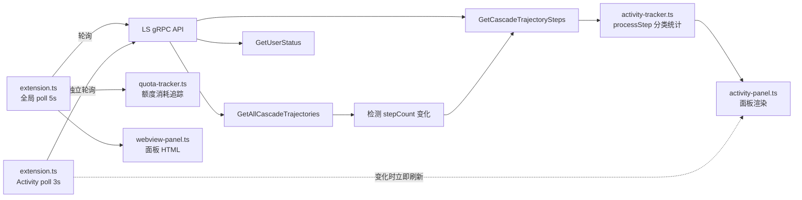

# LS Monitor 技术实现文档

> **v1.11.2** — 2026-03-20

> [!NOTE]
> 本文档所描述的监控数据**完全依赖 LS（Language Server）的 gRPC-over-HTTP API** 返回的数据进行统计和展示。受限于 API 的约 5MB 响应大小限制（约 500 步），超出此窗口的步骤只能通过 `stepCount` 差值进行推算（标注为 📊 推算步数），无法获取精确分类。如有估算偏差或数据不完整，敬请谅解。

## 概述

通过轮询 LS 的 gRPC-over-HTTP API，精确追踪每次 AI 推理调用、工具使用、耗时和 token 消耗。核心逻辑已完全集成到 VS Code 扩展模块中（早期独立脚本 `ls-monitor.ts` 已移除）。

## 架构



## 核心 API

### LS 发现

| 方法 | 说明 |
|---|---|
| `wmic` + `netstat` | 查找 `language_server_windows` 进程，提取 PID、CSRF token、端口 |
| TLS `https://127.0.0.1:{port}` | 连接 LS 的 gRPC-over-HTTP 端点 |

### RPC 端点

| 端点 | 用途 |
|---|---|
| `GetUserStatus` | 获取可用模型列表 (`clientModelConfigs`) |
| `GetAllCascadeTrajectories` | 获取所有对话的 `stepCount` 和状态 |
| `GetCascadeTrajectorySteps` | 获取某对话的全部步骤详情 |

## 步骤类型分类

### 已识别的步骤类型

| CORTEX_STEP_TYPE | 图标 | 分类 | 说明 |
|---|---|---|---|
| `PLANNER_RESPONSE` | 🧠 | reasoning | AI 推理/回复 |
| `VIEW_FILE` | 📄 | tool | 查看文件 |
| `CODE_ACTION` | ✏️ | tool | 编辑代码 |
| `RUN_COMMAND` | ⚡ | tool | 执行命令 |
| `COMMAND_STATUS` | 📟 | tool | 命令状态 |
| `LIST_DIRECTORY` | 📂 | tool | 列出目录 |
| `FIND` | 🔍 | tool | 搜索 |
| `GREP_SEARCH` | 🔎 | tool | Grep 搜索 |
| `CODEBASE_SEARCH` | 🗂️ | tool | 代码库搜索 |
| `MCP_TOOL` | 🔌 | tool | MCP 工具调用 |
| `SEARCH_WEB` | 🌐 | tool | 网页搜索 |
| `READ_URL_CONTENT` | 🌐 | tool | 读取 URL |
| `BROWSER_SUBAGENT` | 🤖 | tool | 浏览器子代理 |
| `ERROR_MESSAGE` | ❌ | system | 错误 |
| `USER_INPUT` | 💬 | user | 用户输入 |
| `CHECKPOINT` | 💾 | system | Checkpoint |
| `CONVERSATION_HISTORY` | 📜 | system | 历史上下文 |
| `KNOWLEDGE_ARTIFACTS` | 📚 | system | 知识库 |
| `EPHEMERAL_MESSAGE` | 💨 | system | 临时消息 |
| `TASK_BOUNDARY` | 📋 | system | 任务边界（Agentic 模式） |
| `NOTIFY_USER` | 📢 | system | 通知用户（Agentic 模式） |

### 浏览器子代理内部步骤

| 内部类型 | 标签 | 说明 |
|---|---|---|
| `BROWSER_PRESS_KEY` | 按键 | 模拟键盘输入 |
| `CLICK_BROWSER_PIXEL` | 点击 | 点击像素坐标 |
| `BROWSER_MOUSE_WHEEL` | 滚动 | 鼠标滚轮 |
| `BROWSER_GET_DOM` | DOM | 获取 DOM |
| `OPEN_BROWSER_URL` | 打开URL | 导航到 URL |
| `WAIT` | 等待 | 延迟等待 |

## 关键数据字段

### 步骤元数据 (step.metadata)

```
metadata: {
  generatorModel:       "MODEL_PLACEHOLDER_M26"     // → 模型 ID
  createdAt:            "2026-...Z"                  // 步骤创建时间 (UTC)
  finishedGeneratingAt: "2026-...Z"                  // 模型输出完成时间 ✅ 实时可用
  viewableAt:           "2026-...Z"                  // 可见时间
  completedAt:          "2026-...Z" | undefined      // 完成时间 ⚠️ 实时获取时推理步骤可能为 undefined
  toolCallOutputTokens: "145"                        // 工具返回内容的 token 数 ✅ 精确
  toolCall: {
    name:           "view_file"                      // 工具名
    argumentsJson:  "{...}"                          // 工具参数 JSON
  }
  modelUsage: { model: "...", ... }                  // checkpoint 里的模型配额使用情况
}
```

### BROWSER_SUBAGENT 结构

```
step: {
  type: "CORTEX_STEP_TYPE_BROWSER_SUBAGENT"
  browserSubagent: {
    task:          "Navigate to ..."                  // 完整任务描述
    taskName:      "Publish Message"                  // 任务标题
    taskSummary:   "..."                             // 任务摘要
    result:        "我已经..."                        // 执行结果文本
    recordingPath: "file:///...webp"                  // 录屏文件路径
  }
  subtrajectory: {
    trajectoryType: "CORTEX_TRAJECTORY_TYPE_BROWSER"
    steps: [ ... ]                                    // 完整子步骤数组 (可达100+步)
  }
}
```

## 踩坑记录

### 1. completedAt 实时不可用

**现象**：推理步骤在实时轮询时 `completedAt = undefined`
**原因**：LS 在步骤完成后并不立即写入 `completedAt`，只在对话结束/checkpoint 后回填
**修复**：推理耗时用 `finishedGeneratingAt`（实时可用），工具耗时用 `completedAt`

### 2. stepCount 波动

**现象**：`stepCount` 从 16→15→16 波动，导致增量检测失败
**原因**：LS 在 RUNNING 状态下 `stepCount` 可能短暂下降
**修复**：当 `curr < prev` 时重置基线为 `currSteps`

### 3. toolCallOutputTokens 含义

- **不是**模型的输入/输出 token
- **是**工具返回给模型的输出内容的 token 数
- 精确度：✅ LS 内部追踪，用于配额计费
- 仅在工具步骤出现，推理步骤为 `undefined`

### 4. 模型名称映射

- LS 内部用 `MODEL_PLACEHOLDER_M26` 等占位符
- 通过 `GetUserStatus` → `clientModelConfigs` 获取 `{ model → label }` 映射
- 例：`MODEL_PLACEHOLDER_M26` → `Gemini 3.1 Pro (High)`

### 5. API 响应 ~5MB 大小限制（startIndex 在当前 LS 版本无效）

- `GetCascadeTrajectorySteps` 每次返回 **≈5.2MB** 数据（约 400-500 步）
- 这是 **5MB 响应大小限制**（经第三方开发者确认），不是步骤数量限制
- 在当前 LS 版本中，`startIndex/endIndex` 参数不生效 — 无论传什么值，始终返回相同的首批步骤
- 所有步骤类型中，**AI 生成的步骤**（PLANNER_RESPONSE、tool 类）都有 `metadata.generatorModel` 字段
- **系统/用户步骤**（EPHEMERAL_MESSAGE、USER_INPUT、CHECKPOINT）没有模型名

**诊断数据（diag-steps.ts）：**

```
RUNNING 对话 (1217 steps):
  [0-50]    → 506 步, 5219KB  (请求 50 步，返回 506)
  [50-100]  → 506 步, 5219KB  (完全相同)
  [1167-1217] → 506 步, 5219KB  (完全相同)

IDLE 对话 (2443 steps):
  7 种 startIndex/endIndex 组合 → 全部返回 419 步, 5293KB
  camelCase/snake_case 字段名 → 无差异
```

**解决方案：Per-Trajectory dominantModel 归属**

```typescript
// 1. 初次处理 API 返回的 ~500 步时，检测该对话的主模型
entry.dominantModel = _detectDominantModel(steps);

// 2. 后续 stepCount 增长（delta > 0）时，直接归属到该模型的 estSteps
if (delta > 0 && entry.dominantModel) {
    const s = _getOrCreateStats(entry.dominantModel);
    s.estSteps += delta;   // 独立计数，不混入 reasoning/toolCalls
    s.totalSteps += delta;
}
```

> ⚠️ 推算步数（📊 标注）仅记录总增量，无法区分 reasoning / toolCalls / errors。
> `dominantModel` 和 `estSteps` 均通过 `globalState` 持久化，跨重启保留。

## 运行方式

活动追踪已完全集成到 VS Code 扩展中，随扩展自动激活。无需手动运行脚本。

```
扩展激活
  ├─ extension.ts 全局轮询 (5s) → 上下文/额度/用户状态
  └─ extension.ts Activity 独立轮询 (3s) → activity-tracker.ts 分类统计 → activity-panel.ts 渲染
```

## PLANNER_RESPONSE 完整结构

```
plannerResponse: {
  thinking:           "思考过程..."          // AI 思维链（可选）
  thinkingSignature:  "base64..."           // 思考签名（可选）
  thinkingDuration:   "2.780691100s"        // ✅ 精确思考耗时
  response:           "以下是..."            // ✅ 最终回复文本
  modifiedResponse:   "以下是..."            // 修改后版本
  messageId:          "bot-uuid..."         // 消息 ID
  toolCalls:          { 0: {...}, ... }     // 工具调用（可选）
  stopReason:         "STOP_REASON_STOP_PATTERN"
}
```

> ⚠️ `plannerResponse.text` 不存在！正确路径是 `.response` 或 `.modifiedResponse`

## CHECKPOINT.modelUsage — 精确 Token 数据

```
metadata.modelUsage: {
  model:                "MODEL_GOOGLE_GEMINI_2_5_FLASH_LITE"
  inputTokens:          "2544"              // ✅ 精确输入 token
  outputTokens:         "46"                // ✅ 精确输出 token
  responseOutputTokens: "46"
  apiProvider:          "API_PROVIDER_GOOGLE_GEMINI"
  responseId:           "..."
  responseHeader:       { sessionID: "..." }
}
```

> Token 数据**仅**在 CHECKPOINT 步骤中出现，PLANNER_RESPONSE 的 metadata 里没有 token 字段

## USER_INPUT 结构

```
step.userInput: {
  items:          [{ text: "用户消息" }]    // ✅ 用户文本在这里
  userResponse:   { 0:"查", 1:"询", ... }  // 逐字流式输入
  activeUserState: { ... }
  clientType:     "CHAT_CLIENT_REQUEST_STREAM_CLIENT_TYPE_IDE"
  userConfig:     { ... }
}
```

> ⚠️ `userInput.text` 不存在！正确路径是 `userInput.items[0].text`

## 踩坑记录补充

### 6. userInput.text 不存在

**现象**：`step.userInput.text` 返回 `undefined`
**正确路径**：`step.userInput.items[0].text`
**说明**：`items` 是数组，通常只有一个元素

### 7. plannerResponse.text 不存在

**现象**：`step.plannerResponse.text` 返回 `undefined`
**正确路径**：`.response` 或 `.modifiedResponse`
**说明**：AI 仅发工具调用时 `response` 为空字符串或不存在

### 8. thinkingDuration 是字符串

**格式**：`"2.780691100s"` — 纳秒级精度
**解析**：`parseFloat(str.replace('s',''))` → 秒数

### 9. stopReason 实时不可靠

**现象**：流式输出中 `plannerResponse.stopReason` 为 `undefined`
**原因**：LS 在模型输出完成前不设置 `stopReason`
**修复**：不用 `stopReason` 判断是否有回复，直接读取 `modifiedResponse || response` 内容
**补充**：AI 回复现在仅捕捉 80 字符短预览，不再需要精确完整回复

### 10. warm-up 必须处理所有对话

**现象**：长时间对话（500+ 步骤）只更新了步骤数但模型统计全 0
**原因**：IDLE 对话在 warm-up 时被设为 `processedIndex = stepCount`（跳过所有步骤）
**修复**：warm-up 对所有对话（含 IDLE）都拉取并处理步骤

### 11. toggle 事件绑定错误

**现象**：点击切换开关无反应
**原因**：`change` 事件绑在 `<label>` 上，但 `change` 只在 `<input>` 上触发
**修复**：通过 `querySelector('input[type="checkbox"]')` 找到内部 checkbox 绑定

## Activity Tracker 架构

### 模块分工

| 文件 | 职责 |
|---|---|
| [activity-tracker.ts](../src/activity-tracker.ts) | 数据处理：步骤分类、统计、时间线、序列化/反序列化 |
| [activity-panel.ts](../src/activity-panel.ts) | UI 渲染：概览卡片、模型卡片、时间线 HTML + CSS |
| [extension.ts](../src/extension.ts) | 粘合层：poll → processTrajectories → 面板刷新 |

### warm-up 与增量策略（v1.11.2 更新）

```
首次 poll → warmedUp = false
  ├─ 所有对话（含 IDLE）→ 拉取全部步骤 → processStep 逐步统计
  └─ warmedUp = true
后续 poll → warmedUp = true（独立 3s 轮询）
  ├─ 新对话 stepCount=0 → 不创建 entry，等待有步骤后首次拉取
  ├─ 新对话 stepCount>0 → 创建 entry → 拉取全部步骤（emitEvent=true）
  ├─ RUNNING 对话 → 重新拉取步骤，处理新增部分
  └─ IDLE 且已处理过 → 跳过（不会再有新步骤）
```

> v1.11.2 变更：Activity 追踪从全局 poll 分离为独立 3 秒轮询循环。
> 仅对 RUNNING 对话发起步骤拉取，IDLE 对话在首次处理后跳过。
> recheck 机制已移除（AI 回复仅捕捉 80 字符短预览，不需要回退重查）。

### 数据范围

- `GetAllCascadeTrajectories` 返回 LS 实例的**所有**对话（跨工作区/跨窗口）
- warm-up 统计全部对话 → 反映完整额度周期使用量
- 额度重置时 `archiveAndReset()` 归档快照并清零统计

### 额度重置自动归档（v1.11.2 新增）

```
额度 tracking 中 → fraction 跳回 ≥ 1.0
  ├─ quota-tracker: 归档 session → 状态 → idle
  ├─ 触发 onQuotaReset 回调
  ├─ activity-tracker.archiveAndReset()
  │   ├─ 快照当前 getSummary() → _archives[]
  │   ├─ 清零所有统计（modelStats/counters/recentSteps）
  │   ├─ 保留 _trajectories 基线（避免 warm-up 重新统计历史）
  │   └─ 保留 _warmedUp = true（增量跟踪继续）
  └─ 持久化 → 刷新状态栏
```

> 关键设计：归档只清零统计，不清除轨迹基线。后续增量跟踪从当前 processedIndex 继续。

## 额度数据来源

### API 路径

```
GetUserStatus → clientModelConfigs[]
  └─ quotaInfo: {
       remainingFraction: 0.85,   // 0.0~1.0，剩余额度比例
       resetTimestamp: "2026-...Z" // 下次重置时间
     }
```

### 重置信号检测（quota-tracker.ts 第 152 行）

```
tracking 状态 + fraction ≥ 1.0 = 额度已重置
  ├─ 当前 quota session 归档
  ├─ 状态 → idle
  └─ ★ 可以在此触发 activity 归档
```

### 额度周期类型

| 类型 | 重置周期 | 对应模型 |
|---|---|---|
| Premium 额度 | ~5 小时 | Gemini 3.1 Pro (High) 等 |
| 会员额度 | ~7 天？ | 待确认 |

> 注：不同模型可能有独立额度周期，通过 `resetTimestamp` 可判断

## 诊断脚本

项目提供两个独立终端脚本，用于在扩展之外直接调试和验证 LS 数据。

### diag-verify.ts — 静态数据完整性诊断

对 LS API 返回的所有数据结构逐项验证，输出 PASS/FAIL 报告。

```bash
npx tsx src/diag-verify.ts
```

**验证阶段：**

| 阶段 | 内容 |
|---|---|
| 0: LS 发现 | wmic/PowerShell 进程扫描、CSRF Token 提取、PID、netstat 端口、RPC 探测 |
| 1: GetUserStatus | clientModelConfigs 结构、quotaInfo.remainingFraction、planInfo、模型列表 |
| 2: GetAllCascadeTrajectories | trajectorySummaries 结构、stepCount/status/summary、workspace 信息 |
| 3: GetCascadeTrajectorySteps | 步骤类型分类（未文档化类型检测）、USER_INPUT/PLANNER_RESPONSE/CHECKPOINT 结构验证、踩坑字段检查 |
| 4: startIndex/endIndex | 验证 startIndex 参数是否生效（文档记录为不生效） |
| 5: 模型名称映射 | MODEL_PLACEHOLDER_MXX → 显示名称映射正确性 |

**输出示例：**

```
  ✅ PASS [D-01] wmic 进程扫描
  ✅ PASS [S-03] 步骤类型全部已文档化
  ❌ FAIL [S-XX] 发现 2 个未文档化类型: CORTEX_STEP_TYPE_NEW_TYPE
```

> 前提条件：Antigravity IDE 已启动且至少有一个对话。

---

### diag-monitor.ts — 实时步骤监视器

持续轮询 LS，逐条显示每个对话的新增步骤，用于验证增量捕获是否精确。

```bash
npx tsx src/diag-monitor.ts
# Ctrl+C 停止
```

**功能：**

- 每 3 秒轮询 `GetAllCascadeTrajectories`
- 检测到 `stepCount` 变化时，拉取步骤并精确显示新增部分
- 显示每步的：序号、图标、类型、模型 ID、内容摘要
- 检测 API 窗口外步骤并警告

**输出示例：**

```
─── [19:14:28] Introducing Myself (IDLE) +6 步 (0→6) ───
  API 返回 6 步 (请求 6)
  ✓ 新步骤可精确捕获 (index 0..5):
    [   0] 💬 USER_INPUT             "请简单自我介绍一下自己..."
    [   1] 📜 CONVERSATION_HISTORY
    [   2] 📚 KNOWLEDGE_ARTIFACTS
    [   3] 💨 EPHEMERAL_MESSAGE
    [   4] 🧠 PLANNER_RESPONSE       [MM37] thinking="..." dur=0.886s
    [   5] 💾 CHECKPOINT             in=3166 out=77 model=MODEL_...
```

> 用于对比扩展内 activity-tracker 的捕获结果，确保两者一致。

---

## 文件位置

- 插件源码：`src/`
- 诊断脚本：`src/diag-verify.ts`（静态诊断）、`src/diag-monitor.ts`（实时监视）
- 技术文档：本文件

> 注：独立终端脚本 `ls-monitor.ts` 已删除（v1.11.2），功能完全集成到扩展模块中。

## 踩坑记录补充（二）

### 12. 增量步骤捕获 bug（已修复）

**现象**：增量更新时新步骤显示为 `+N steps (estimated)` 而非逐步精确捕获
**原因**：`processTrajectories` 增量路径在 `processedIndex > 0` 时直接使用 `stepCount` delta 估算，不重新拉取步骤
**修复**：增量路径重新调用 `GetCascadeTrajectorySteps` 拉取步骤，仅对超出 API 窗口的步骤使用 delta 估算

### 13. 新对话首消息延迟（已修复）

**现象**：新对话的第一条消息不出现在 timeline，要到第二条消息才刷新
**原因**：新对话首次出现时 `stepCount=0`（LS 还在初始化），代码创建了 `processedIndex=0` 的空 entry；下次 poll 时 `0 <= 0` → skip
**修复**：`currSteps === 0` 的新对话不创建 entry，等到有步骤时才创建并拉取

### 14. 思考时间在轮询模式下不准确

**现象**：3 秒轮询捕获到正在进行中的 PLANNER_RESPONSE 时，`thinkingDuration` 为部分值
**决策**：Timeline 行级推理事件不显示 `durationMs`（设为 0），模型卡片中的聚合 `thinkingTimeMs` 保留（累积后偏差会平衡）

### 15. StreamCascadePanelReactiveUpdates（未采用）

**发现**：LS 内部有 `StreamCascadePanelReactiveUpdates` 双向 gRPC 流，可实时推送 Cascade 状态变化
**限制**：需要 protobuf 二进制解码 + HTTP/2 持久连接 + 逆向 proto 定义；当前 Connect-RPC (HTTP/JSON) 无法使用
**现状**：保持 3 秒 HTTP 轮询方案，对 95% 的对话（< 500 步）已足够精确

### 16. LS 进程有 3 个端口（实测 v1.11.3）

**发现**：LS 进程绑定了 3 个 `127.0.0.1` 端口（如 3618、13856、13857）
**RPC 端口**：仅其中一个是 Connect-RPC（HTTPS）端口，其余为 extension server 或其他内部用途
**影响**：端口探测必须遍历所有 LISTENING 端口 + HTTP/HTTPS 双重尝试，取第一个可达的

### 17. API 窗口边界实测数据（v1.11.3）

**实测结果**（2026-03-20）：

| 对话 | stepCount | API 返回 | 不可见 | 响应大小 |
|---|---|---|---|---|
| 505 步（RUNNING） | 505 | 426 | 79 | — |
| 2443 步（历史） | 2443 | 419 | 2024 | 5084 KB |

**结论**：
- 窗口大小由 **响应体积（~5MB）** 决定，不是固定步数
- 不同对话返回的步数略有差异（419 vs 426），取决于每步的数据量
- `startIndex/endIndex` 参数持续无效（v1.11.3 验证）
- 超出窗口的步骤用 📊 图标 + `stepIndex` 标记起始位置，保持排版一致
