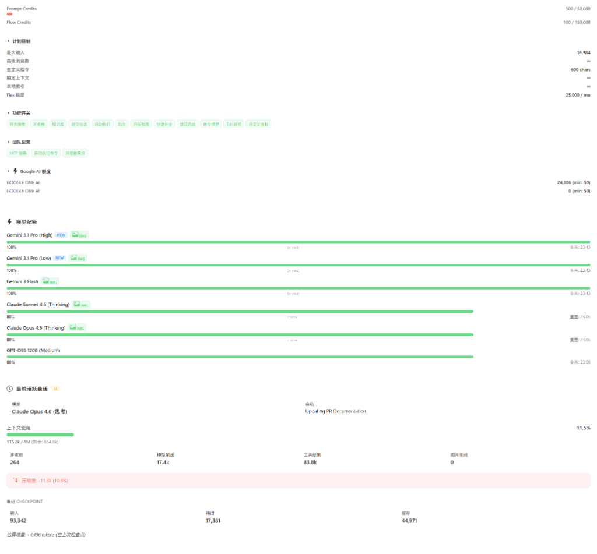

# 🌌 Antigravity 实时上下文窗口监控

一个专为 **Antigravity**（Google 基于 Windsurf 修改的 IDE）开发的插件，用于实时**监控所有聊天会话的上下文窗口使用情况**。

**[🇺🇸 English Documentation / 英文文档](README.md)**

---

> [!WARNING]
> **平台支持**
>
> 🍏 **macOS**: 完全支持。通过 `ps` 和 `lsof` 命令实现进程发现。
>
> 🐧 **Linux**: 完全支持（v1.6.0+）。通过 `ps` 和 `lsof`/`ss` 实现进程发现。已在 Ubuntu 22.04 (x64 & ARM64) 上测试通过。
>
> 🪟 **Windows**: 完全支持（v1.8.0+）。通过 `wmic` 缓存和 PowerShell 回退机制优化了发现逻辑。
>
> 🐧🪟 **WSL**: 完全支持（v1.12.0+）。通过 `/proc/version` 检测 WSL 环境，利用 WSL 互操作调用 Windows 端工具进行 LS 发现。v1.12.1 新增 `extensionKind: ["ui", "workspace"]`，通过 Remote-WSL 或 Remote SSH 连接时扩展自动运行在本地 Windows 宿主机上。v1.13.0 新增 **Remote-WSL LS 发现** — 连接 WSL 工作区时，扩展通过 `wsl -d <distro>` 发现 WSL 内部运行的 `language_server_linux_x64` 进程，通过 WSL2 端口转发连接并显示正确的上下文数据。

---

## 📚 技术细节

👉 **[阅读技术实现说明](docs/technical_implementation.md)**

---

## ✨ 主要功能

* **⚡ 实时 Token 监控**
    状态栏显示当前 Token 消耗，格式如 `125k/200k, 62.5%`。Token 数据优先取自模型 checkpoint 的精确值（`inputTokens` + `outputTokens`），两次 checkpoint 之间通过基于实际文本内容的字符估算实时计算增量（v1.4.0 起替代了固定常量）。仅在步骤数据结构缺失时 fallback 到固定常量。

* **🌐 语言切换**
    用户可选择仅中文、仅英文或双语显示模式。点击状态栏 → 设置 → 切换显示语言即可访问。偏好通过 `globalState` 跨会话持久化。

* **🔒 多窗口隔离**
    每个 Antigravity 窗口只显示本工作区的对话数据。插件通过 workspace URI 过滤，多窗口之间互不干扰。

* **🗜️ 上下文压缩检测**
    当模型自动压缩对话历史时，插件通过双层检测机制识别：主层比较连续 checkpoint 的 `inputTokens`（下降超过 5000 tokens 即判定，天然免疫 Undo 误报），降级层比较跨轮询 `contextUsed` 变化（带 Undo 排除守卫）。状态栏显示 `~100% 🗜` 压缩标识。

* **⏪ Undo/Rewind 支持**
    撤销对话步骤后，插件检测到 `stepCount` 减少，会重新计算 Token 用量，显示回滚后的准确值。

    | 回退前 | 回退后 |
    | :---: | :---: |
    |  |  |

* **🔄 动态模型切换**
    对话中切换模型时，上下文窗口上限自动更新为当前模型的限制值。v1.4.0 起通过 `GetUserStatus` API 动态获取模型显示名称。

* **🎨 图片生成追踪**
    使用 Gemini Pro 对话中调用 Nano Banana Pro 生成图片时，相关 Token 消耗会被计入，tooltip 中以 `📷` 标记。检测逻辑基于 step type 和 generator model 名称匹配。

    

* **🛌 自动退避轮询**
    语言服务器不可用时，轮询间隔按 `baseInterval × 2^n` 递增（默认 5s → 10s → 20s → 60s），重连后立即恢复正常间隔。

* **📊 WebView 监控面板** *(v1.10.1 新增)*
    点击状态栏打开侧边面板全景仪表盘。展示账户计划与等级、Prompt / Flow Credits（额度）余额、每模型配额使用量（带颜色进度条）、功能开关、团队配置（MCP Servers、Auto-Run 等）、Google AI 额度。所有数据来自已有的 `GetUserStatus` API——零额外网络请求。
    * **🛡️ 隐私遮罩**：面板顶部盾牌按钮可遮罩姓名和邮箱，开关状态跨刷新持久化。
    * **📂 可折叠区域**：次要信息（计划限制、功能开关、团队配置、Google AI 额度）默认折叠，展开/收起状态持久化。

* **⚙️ 交互式设置仪表盘** *(v1.11.0 新增)*
    WebView 面板重构为「监控」和「设置」双标签页。设置页提供直观的图形化界面，一站式配置扩展行为——无需手动编辑 `settings.json`。
    * **🎯 自定义压缩警告阈值**：设定自定义「警戒线」（支持 150K、200K、500K、900K 快捷预设），在 Antigravity 后端压缩触发（~200K）之前提前预警。状态栏颜色基于该阈值而非模型完整上限变化。
    * **🟢 状态栏额度指示灯**：当前模型的配额百分比带彩色状态灯（`🟢`、`🟡`、`🔴`）直接显示在状态栏上。
    * **⏳ 当前模型重置倒计时**：状态栏倒计时现在跟随你当前正在使用的模型的重置时间，而不再是所有模型中最早的那个。
    * **🎛️ 状态栏显示开关**：独立开关控制「上下文用量」、「额度指示灯」与「重置倒计时」的显示/隐藏。
    * **⏸️ 暂停/恢复**：暂停自动刷新以冻结面板数据，方便排查问题。

* **🧠 模型活动监控** *(v1.11.2 新增，v1.11.3 & v1.12.2 增强)*
    新增活动标签页，实时追踪 AI 推理调用、工具使用、Token 消耗和每模型耗时。通过主状态栏或 `Show Model Activity` 命令访问。
    * **🔧 工具名称显示** *(v1.11.3)*：时间线条目显示工具名称（如 `view_file`、`gh/search_issues`）和步骤序号标签。
    * **⚡ 独立 Activity 轮询** *(v1.11.3)*：Activity 追踪运行在独立的 3 秒轮询循环中，与全局 5 秒轮询解耦，更新更快。
    * **🎯 三层额度检测** *(v1.12.2)*：即时检测（周期内已用时间比较）、漂移检测（resetTime 观察）、额度检测（fraction 变化）。不再使用硬编码周期——自动适配任何额度周期。
    * **🔀 归档防抖合并** *(v1.12.2)*：不同配额池在 5 分钟内先后重置时自动合并为单条归档，避免碎片化。
    * **💾 数据持久化**：活动统计通过 `globalState` 跨 VS Code 重启保存，写入频率限制为每 30 秒一次。
    * **📋 自动归档**：模型额度重置时，当前活动自动归档到历史记录，带来源追踪（`triggeredBy`），生成每周期使用报告。
    * **📊 推算步数**：当对话超过 LS API 约 500 步获取窗口时，额外步数以推算方式记录，UI 上以 `📊` 标记明确区分。
    * **⚠️ 低额度通知**：当任意模型剩余额度低于可配置阈值（默认 20%）时弹出警告通知。

## 🤖 支持的模型

| 模型 | Internal ID / 内部 ID | 上下文上限 |
| --- | --- | --- |
| Gemini 3.1 Pro (High) | MODEL_PLACEHOLDER_M37 | 1,000,000 |
| Gemini 3.1 Pro (Low) | MODEL_PLACEHOLDER_M36 | 1,000,000 |
| Gemini 3 Flash | MODEL_PLACEHOLDER_M47 | 1,000,000 |
| Claude Sonnet 4.6 (Thinking) | MODEL_PLACEHOLDER_M35 | 1,000,000 |
| Claude Opus 4.6 (Thinking) | MODEL_PLACEHOLDER_M26 | 1,000,000 |
| GPT-OSS 120B (Medium) | MODEL_OPENAI_GPT_OSS_120B_MEDIUM | 128,000 |

*模型 ID 来自 Antigravity 本地语言服务器的 `GetUserStatus` API。如果新增了模型，可以在 IDE 设置中手动覆盖上下文上限。*

## 🚀 使用方法

1. **安装**:
   * **OpenVSX**: 直接从 [Open VSX Registry](https://open-vsx.org/extension/AGI-is-going-to-arrive/antigravity-context-monitor) 安装。
   * **手动安装**: 通过"扩展 → 从 VSIX 安装"将 `.vsix` 文件安装到 Antigravity IDE。
2. **查看状态**: 右下角状态栏显示当前上下文使用情况（空白聊天时显示 `0k/1000k, 0.0%`）。
3. **悬停详情**: 将鼠标悬停在状态栏项上，查看详细信息（模型、输入/输出 Token、剩余容量、压缩状态、图片生成步骤、每模型配额摘要等）。

   

4. **点击查看 — WebView 监控面板**: 点击状态栏项，打开侧边 **WebView 监控面板**：
   * **账户与额度**：一览账户计划名称、用户等级、Prompt / Flow Credits 余额。
   * **模型配额**：每个模型显示颜色进度条（绿 → 黄 → 红），附带配额重置时间。
   * **当前会话**：展示当前活跃对话的上下文使用量、模型、步骤数、压缩状态。
   * **其他会话**：列出同一工作区的其他近期对话。
   * **隐私遮罩**：点击面板顶部 🛡️ 盾牌按钮隐藏你的姓名和邮箱，再次点击恢复。遮罩状态跨刷新持久化。
   * **折叠详情**：点击 ▶ 三角形展开查看计划限制、功能开关、团队配置或 Google AI 额度，默认折叠以保持面板简洁。

   

## ⚠️ 已知限制

> [!IMPORTANT]
> **同一工作区多窗口**
> 如果在**同一个文件夹**上打开多个 Antigravity 窗口，它们共享相同的 workspace URI，会话数据可能会混合。
>
> **解决方法**: 不同窗口打开不同的文件夹。

> [!NOTE]
> **上下文压缩提示**
> 压缩完成通知（🗜 图标）持续约 15 秒（3 个轮询周期）后恢复正常显示。

> [!IMPORTANT]
> **Antigravity 内部总结机制**
> Antigravity IDE 对检查点总结有一个硬编码的 7500 token "总结阈值" (Summarization Threshold)。这意味着当对话非常长且跨过该阈值后，Token 计数可能会出现轻微偏差。更多细节请参考 [Reddit 社区讨论](https://www.reddit.com/r/google_antigravity/comments/1q7zcag/heres_how_to_find_which_mcp_tools_are_leading_to/)。

> [!NOTE]
> **子智能体动态切换**
> 使用 Claude 模型时，Antigravity 可能会调用 Gemini 2.5 Flash Lite 作为子智能体处理轻量任务。自 v1.10.0 起，Claude 4.6 模型也拥有 1M 上下文限制（2026-03-13 GA），因此子智能体切换不再导致可见的上下文上限变化。

## ⚙️ 设置

| 设置项 | 默认 | 说明 |
| --- | --- | --- |
| `pollingInterval` | 5 | 轮询频率（秒） |
| `contextLimits` | (见默认值) | 手动覆盖模型的上下文上限 |
| `compressionWarningThreshold` | 200000 | 压缩警告阈值（token 数）。状态栏颜色基于此值判断。 |
| `statusBar.showContext` | true | 状态栏显示上下文用量（如 `45k/1M, 4.5%`） |
| `statusBar.showQuota` | true | 状态栏显示当前模型额度指示灯（如 `🟢85%`） |
| `statusBar.showResetCountdown` | true | 状态栏显示重置倒计时（如 `⏳4h32m`） |

| `quotaNotificationThreshold` | 20 | 模型剩余额度低于此百分比时弹出警告（设为 0 可禁用） |
| `activity.maxRecentSteps` | 100 | 活动时间线最多保留的操作条数 |
| `activity.maxArchives` | 20 | 活动归档最多保留份数 |

## 🔤 命令

| 命令 | 说明 |
| --- | --- |
| `Show Context Window Details` | 打开 QuickPick 面板显示所有被追踪的会话 |
| `Refresh Context Window Monitor` | 重新发现语言服务器并重启轮询 |
| `Switch Display Language` | 选择仅中文、仅英文或双语显示模式 |
| `Show Model Activity` | 打开监控面板的活动标签页 |

## ⭐ Star History / Star 趋势

---
**作者**: AGI-is-going-to-arrive
**版本 / Version**: 1.13.91
